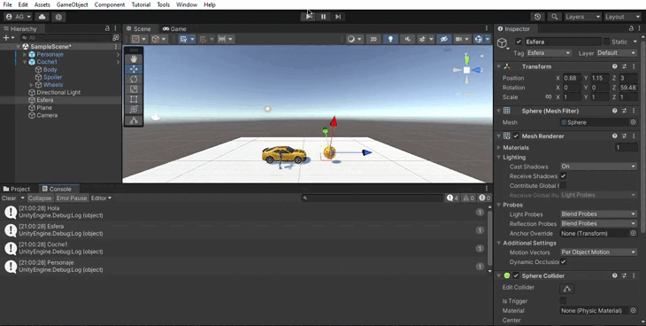

## PRÁCTICA 1
En este proyecto he añadido como objeto 3D básico una esfera. En el proyecto está incluido el paquete Starter Assets. De este paquete he añadido un personaje.

Todos los componentes del proyecto están etiquetados y como prefabs de Starter Asset, utilizo el personaje antes mencionado.

