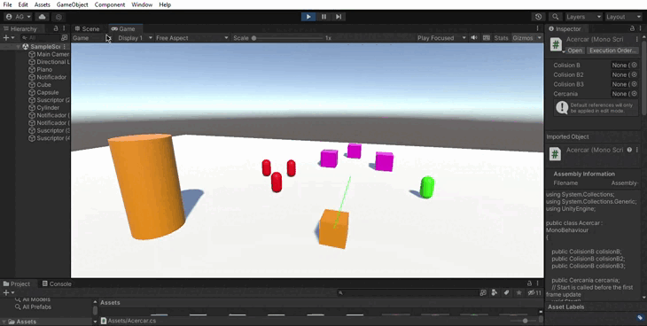

## PRÁCTICA 3
### PRIMERA PARTE
- Como ningún objeto tiene físicas no se moveran de la posición establecida manualmente.
- Ahora la esfera tiene físicas por lo que le afecta la gravedad y caerá sobre el plane establecido como suelo. El cubo no se moverá.
- Ambos caerán al suelo por el efecto de la gravedad, la esfera incluso rodará.
- Es la misma situación que la anterior pero en este caso la esfera pesará 10 veces más que el cubo y cae con más velocidad.
- La esfera caerá por efecto de la gravedad, pero el cubo no se moverá al no tener física. El cubo es de tipo IsTrigger por lo que no se verá afectado por las colisiones.
- Ambos componentes caerán por efecto de la gravedad, pero el cubo al ser de tipo IsTrigger atravesará el suelo.
- La esfera y el cubo caen al suelo. La esfera cae con más velocidad que el cubo. El cubo solo prodrá rotar sobre el eje y.
## SEGUNDA PARTE
- El personaje se desplaza por la pantalla pero si caer al suelo.
- Se puede modificar la velocidad desde el inspector de objectos sin necesidad de editar el script.
## TERCERA PARTE
- Las acciones programadas se pueden ver de mejor manera en el gif a continuación.

